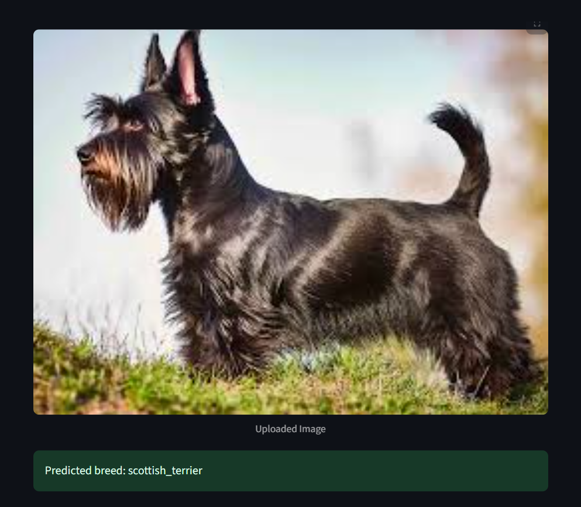

# 🐶 Oxford Pets Breed Classifier

This project is an image classification app that identifies pet breeds from images using a Convolutional Neural Network (CNN). The model is trained on the [Oxford-IIIT Pet Dataset](https://www.robots.ox.ac.uk/~vgg/data/pets/) and deployed via a Streamlit web interface.

## 📌 Overview

- 🧠 Model: MobileNetV2 (pretrained on ImageNet)
- 📚 Dataset: 37 dog & cat breeds
- 🧪 Frameworks: TensorFlow, Streamlit, MLflow
- 🖼️ Input: Any image of a dog or cat
- 🔍 Output: Predicted breed + confidence score

## 🚀 Run the App Locally

### 1. Clone the repository
```bash
git clone https://github.com/yourusername/oxford-pets-classifier.git
cd oxford-pets-classifier
```

### 2. Install dependencies
```bash
pip install -r requirements.txt
```

### 3. Run the Streamlit app
```bash
streamlit run app.py
```

### 🚀 Live Demo

Try the model in your browser:

👉 [**Click here to open the live app**](https://cnn-image-classifier-pets-14.streamlit.app/)

Upload an image of a pet (dog or cat), and the model will predict its breed in real-time.

## 🔍 UI



---

## 📁 Project Structure

```
oxford-pets-classifier/
│
├── app.py                   # Streamlit app
├── pets_model.h5            # Trained model file
├── requirements.txt         # Dependencies
├── train_pets_mlflow_cm.py  # Training script with MLflow tracking
└── README.md                # Project description
```

## 📚 Model Training Details

- Dataset loaded using `tensorflow_datasets`
- Images resized to 224x224 and normalized
- Transfer learning with MobileNetV2 + custom dense layers
- Evaluated using accuracy, classification report, confusion matrix
- Also attempted fine-tuning the base MobileNetV2 layers, but it did not improve accuracy on the test set. The pretrained features performed better when left frozen.

---

## 🧪 MLflow Integration

This project uses **MLflow** for:

- Automatic experiment tracking (`accuracy`, `loss`, `val_accuracy`, etc.)
- Saving models as versioned artifacts
- Logging evaluation metrics like **confusion matrix** and **classification report**
- Comparing runs with and without fine-tuning

To view experiments:

```bash
mlflow ui
```

Then visit: [http://localhost:5000](http://localhost:5000)

---

## 💡 Notes

- Keras 3 requires saving the model as `.h5` for compatibility with `load_model()` in Streamlit
- Prediction includes the most likely breed and its confidence score
